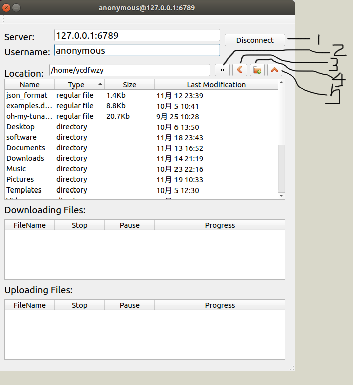

# 客户端使用说明

## 运行

在`exe/`目录下打开命令行，输入命令`./tinyFTP.sh`运行客户端

> 如果没有运行权限，可以使用`chmod +x tinyFTP.sh`修改运行权限

运行后可以看到如下登录界面：

正确输入IP、端口、用户名和密码后，点机下方按钮可以登录到服务器。

## 主界面

登录到服务器后，会看到如下界面

界面上方给出了登录服务器的IP、端口和登录名，都是不可修改的文本框。右边的按钮1是断开连接按钮，点击后可以看到之前提到的登陆界面。

下方是服务器当前目录地址栏，地址栏可编辑地址。右边有四个按钮：点击按钮2可以前往地址烂中的地址，点击按钮3可以返回上一级目录，点击按钮4可以在当前目录下新建一个文件夹，点击按钮5可以在当前目录上传本地文件。

地址栏下方是目录文件列表，列出了当前目录下的文件。点击列表上方的小标题可以给按照文件名、类型、大小排序。

选择某一文件，右击出现右击菜单，包括四个选项：`下载Downlad`、`刷新Refresh`、`重命名Rename`、`删除Delete`，分别实现下载该文件到指定本地目录、刷新文件目录、重命名该文件、删除该文件。如果右击文件夹，右键菜单与文件的类似，只是少了下载的选项。

双击选定的文件夹，可以进入到文件夹内，双击选定的文件，可以下载该文件。

## 下载和上传

下载和上传时的界面如下：

每一个上传或下载任务占表格中的一行，对于正在进行的任务，点击`PAUSE`可以暂停当前任务，然后可以点击其他暂停任务的`CONTINUE`切换任务。点击某一任务的`STOP`按钮可以放弃该下载/上传任务。